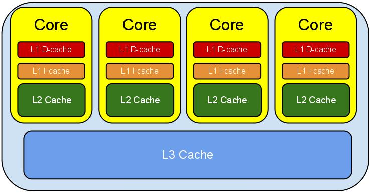

| 队列名称                | 实现方式               | 线程安全性                | 容量特性             | 操作特点                                           | 适用场景                                 |
| ----------------------- | ---------------------- | ------------------------- | -------------------- | -------------------------------------------------- | ---------------------------------------- |
| `ArrayDeque`            | 基于数组               | 非线程安全                | 无容量限制，自动扩容 | 支持双端操作，随机访问效率高                       | 需要频繁在队列两端操作，如实现栈或队列   |
| `LinkedList`            | 基于链表               | 非线程安全                | 无容量限制           | 插入和删除元素效率高，随机访问效率低               | 频繁插入和删除元素，特别是在队列两端操作 |
| `PriorityQueue`         | 基于堆（通常是二叉堆） | 非线程安全                | 无容量限制           | 元素按优先级排序，插入和删除时间复杂度\(O(log n)\) | 需要根据元素优先级排序和处理，如任务调度 |
| `ConcurrentLinkedQueue` | 基于链表               | 线程安全（使用 CAS 操作） | 无界                 | 非阻塞队列，插入和删除不阻塞线程                   | 多线程高并发场景，高效插入和删除元素     |
| `ArrayBlockingQueue`    | 基于数组               | 线程安全                  | 有界                 | 支持公平和非公平模式，插入和删除可能阻塞           | 生产者 - 消费者模式，需要控制队列大小    |
| `LinkedBlockingQueue`   | 基于链表               | 线程安全                  | 可选有界或无界       | 插入和删除操作可能阻塞                             | 生产者 - 消费者模式，可灵活控制队列大小  |
| `SynchronousQueue`      | 无实际存储元素的队列   | 线程安全                  | 无容量               | 每个插入操作必须等待另一个线程的移除操作           | 直接传递数据，生产者和消费者紧密耦合场景 |
| `PriorityBlockingQueue` | 基于堆                 | 线程安全                  | 无界                 | 元素按优先级排序，插入和删除操作可能阻塞           | 多线程环境下按优先级处理任务             |
| `DelayQueue`            | 基于优先级队列         | 线程安全                  | 无界                 | 元素具有延迟属性，只有延迟过期才能被取出           | 需要延迟处理任务的场景                   |

## 对 volatile类型的变量进行 CAS 操作，存在伪共享问题

## Disruptor

Disruptor 是英国外汇交易公司 LMAX 开发的一个高性能的并发框架。

可以认为是线程间通信的高效低延时的内存消息组件，它最大的特点是高性能。

与 Kafka、RabbitMQ 用于服务间的消息队列不同，disruptor 一般用于一个 JVM 中多个线程间消息的传递。

Disruptor 最直接的应用场景自然就是“生产者-消费者”模型的应用场合了，虽然这些我们使用 JDK 的 BlockingQueue 也能做到，但 Disruptor 的性能比 BlockingQueue 提高了 5~10 倍左右： 

也就是说 BlockingQueue 能做的，Disruptor 都能做到且做的更好。同时 Disruptor 还能做得更多：

## CPU缓存架构

L1、L2、L3分别表示一级缓存、二级缓存、三级缓存，越靠近CPU的缓存，速度越快，容量也越小。

- L1缓存很小但很快，并且紧靠着在使用它的CPU内核；

- L2大一些，也慢一些，并且仍然只能被一个单独的CPU核使用；

- L3更大、更慢，并且被单个插槽上的所有CPU核共享；

- 最后是主存，由全部插槽上的所有CPU核共享。

***L3 Cache和L1，L2 Cache有着本质的区别。***

L1和L2 Cache都是每个CPU core独立拥有一个，而L3 Cache是几个Cores共享的，可以认为是一个更小但是更快的内存。

## 伪共享问题（False Sharing）的本质

出现伪共享问题（False Sharing）的原因：

- 一个缓存行可以存储多个变量（存满当前缓存行的字节数）；64个字节可以放8个long，16个int

- 而CPU对缓存的修改又是以缓存行为最小单位的； 不是以long 、byte这样的数据类型为单位的

- 在多线程情况下，如果需要修改“共享同一个缓存行的其中一个变量”，该行中其他变量的状态 就会失效，甚至进行一致性保护

所以，伪共享问题（False Sharing）的本质是：

对缓存行中的单个变量进行修改了，导致整个缓存行其他不相关的数据也就失效了，需要从主存重新加载

如果 其中有 volatile 修饰的变量，需要保证线程可见性的变量，还需要进入 缓存与数据一致性的保障流程， 如mesi协议的数据一致性保障 用了其他变量的 Core的缓存一致性。

缓存一致性是根据缓存行为单元来进行同步的，假如 y是 volatile 类型的，假如a修改了x，而其他的线程用到y，虽然用到的不是同一个数据，但是他们（数据X和数据Y）在同一个缓存行中，其他的线程的缓存需要保障数据一致性而进行数据同步，当然，同步也需要时间。

## Disruptor如何实现高性能？

### 1. 无锁设计

- **传统锁机制的问题**：在多线程环境中，使用传统的锁（如`synchronized`关键字或`ReentrantLock`）会导致线程上下文切换和锁竞争，这会带来较大的性能开销。
- **Disruptor 的做法**：Disruptor 使用 CAS（Compare - And - Swap）操作来替代传统锁。CAS 是一种乐观锁机制，它在更新数据时先比较当前值是否和预期值一致，如果一致则进行更新，否则重试。这种方式避免了线程阻塞和上下文切换，提高了并发性能。

### 2. 环形缓冲区（Ring Buffer）

- **数据结构优势**：Disruptor 使用环形缓冲区作为其底层数据结构。环形缓冲区本质上是一个固定大小的数组，通过头尾指针来管理数据的读写。这种结构避免了内存分配和释放的开销，因为数组的大小是固定的，不会像链表那样频繁进行内存操作。
- **顺序访问**：环形缓冲区支持顺序访问，这对 CPU 缓存友好。当数据被顺序访问时，CPU 可以将相邻的数据预取到缓存中，减少了内存访问的延迟。

### 3. 缓存行填充

- **伪共享问题**：在多线程环境下，多个线程访问的变量如果位于同一个缓存行，会导致伪共享问题，降低性能。
- **解决方式**：Disruptor 通过在关键变量（如序列号）周围填充足够的字节，确保每个关键变量独占一个缓存行，避免了伪共享带来的性能损耗。

### 4. 预分配内存

- **减少内存分配开销**：Disruptor 在初始化时就会预先分配好环形缓冲区的内存空间。在运行过程中，不会再进行动态的内存分配和释放操作，从而避免了内存碎片和垃圾回收的开销，提高了系统的稳定性和性能。

### 5. 批量处理和事件预分配

- **批量处理**：Disruptor 支持批量处理事件。消费者可以一次性获取多个事件进行处理，减少了消费者与生产者之间的交互次数，提高了处理效率。
- **事件预分配**：在初始化时，Disruptor 会预先分配好事件对象，生产者和消费者在使用时直接获取和释放这些对象，避免了频繁创建和销毁对象的开销。

### 6. 高效的事件通知机制

- **减少等待时间**：Disruptor 采用了高效的事件通知机制，当生产者生产新的事件时，会及时通知消费者进行处理。这种机制减少了消费者的等待时间，提高了系统的响应速度。

### 7. 元素位置定位
- 数组长度2^n，通过位运算，加快定位的速度。

- 下标采取递增的形式。不用担心index溢出的问题。

- index是long类型，即使100万QPS的处理速度，也需要30万年才能用完。

## Disruptor使用环形队列的优势：

### 内存使用方面

- **固定内存分配**：环形队列本质上是一个固定大小的数组，在初始化时就会分配好所需的内存空间。在整个运行过程中，不会有动态的内存分配和释放操作。这避免了因频繁内存分配和释放导致的内存碎片问题，也减少了垃圾回收的压力，尤其在高并发、大数据量的场景下，能显著提升系统的稳定性和性能。
- **内存复用**：当生产者写入数据覆盖之前的数据时，实际上是在复用已分配的内存空间。这种方式使得内存的使用效率更高，避免了额外的内存开销。

### 访问效率方面

- **顺序访问特性**：环形队列支持顺序访问数据。在计算机系统中，顺序访问对 CPU 缓存十分友好。CPU 可以利用预取机制，提前将相邻的数据加载到缓存中，从而减少内存访问的延迟，提高数据的读取和写入速度。
- **索引计算简单**：环形队列的索引计算相对简单。通过取模运算，可以快速定位到数组中的位置。例如，假设环形队列的大小为`n`，当前索引为`i`，下一个索引可以通过`(i + 1) % n`来计算。这种简单的计算方式在高并发场景下能减少计算开销，提高系统的响应速度。

### 并发处理方面

- **无锁设计基础**：环形队列为 Disruptor 的无锁设计提供了基础。在多线程环境下，多个生产者和消费者可以同时对环形队列进行操作。由于队列的结构固定，生产者和消费者可以通过各自维护的索引来独立地进行读写操作，使用 CAS（Compare - And - Swap）等原子操作来保证数据的一致性，避免了传统锁机制带来的线程阻塞和上下文切换开销。
- **高效的并发控制**：通过对环形队列的巧妙设计，Disruptor 可以实现高效的并发控制。例如，生产者和消费者可以通过序列号来协调操作，避免了数据竞争和不一致的问题。生产者在写入数据时会先获取一个可用的序列号，消费者则根据序列号来读取数据，确保了数据的有序性和正确性。

### 数据处理方面

- **批量处理支持**：环形队列使得 Disruptor 能够支持批量处理数据。消费者可以一次性获取多个连续的数据元素进行处理，减少了与生产者之间的交互次数，提高了处理效率。这种批量处理的方式在处理大量数据时尤为有效。
- **事件预分配**：在环形队列中，可以预先分配好事件对象。生产者和消费者在使用时直接获取和释放这些对象，避免了频繁创建和销毁对象的开销，进一步提高了系统的性能。

## 使用环形队列的优势

### 第一，简化了多线程同步的复杂度。

学数据结构的时候，实现队列都要两个指针head和tail来分别指向队列的头和尾，对于一般的队列是这样，

想象下，如果有多个生产者同时往缓冲区队列中提交任务，某一生产者提交新任务后，tail指针都要做修改的，那么多个生产者提交任务，头指针不会做修改，但会对tail指针产生冲突，

例如某一生产者P1要做写入操作，在获得tail指针指向的对象值V后，执行compareAndSet（）方法前，tail指针被另一生产者P2修改了，这时生产者P1执行compareAndSet（）方法，发现tail指针指向的值V和期望值E不同，导致冲突。

同样，如果多个消费者不断从缓冲区中获取任务，不会修改尾指针，但会造成队列头指针head的冲突问题（因为队列的FIFO特点，出列会从头指针出开始）。

环形队列的一个特点就是只有一个指针，只通过一个指针来实现出列和入列操作。

如果使用两个指针head和tail来管理这个队列，有可能会出现“伪共享”问题（伪共享问题在下面我会详细说），

因为创建队列时，head和tail指针变量常常在同一个缓存行中，多线程修改同一缓存行中的变量就容易出现伪共享问题。

### 第二，由于使用的是环形队列，那么队列创建时大小就被固定了，

Disruptor框架中的环形队列本来也就是基于数组实现的，使用数组的话，减少了系统对内存空间管理的压力，

因为数组不像链表，Java会定期回收链表中一些不再引用的对象，而数组不会出现空间的新分配和回收问题。